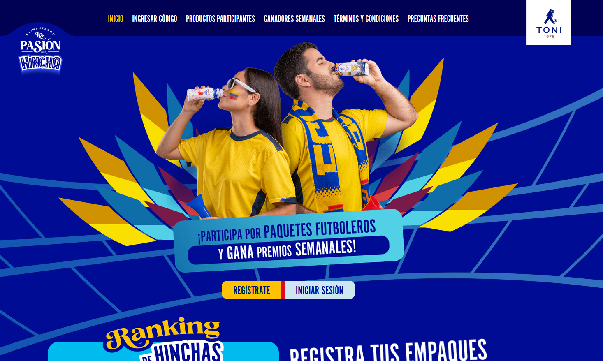
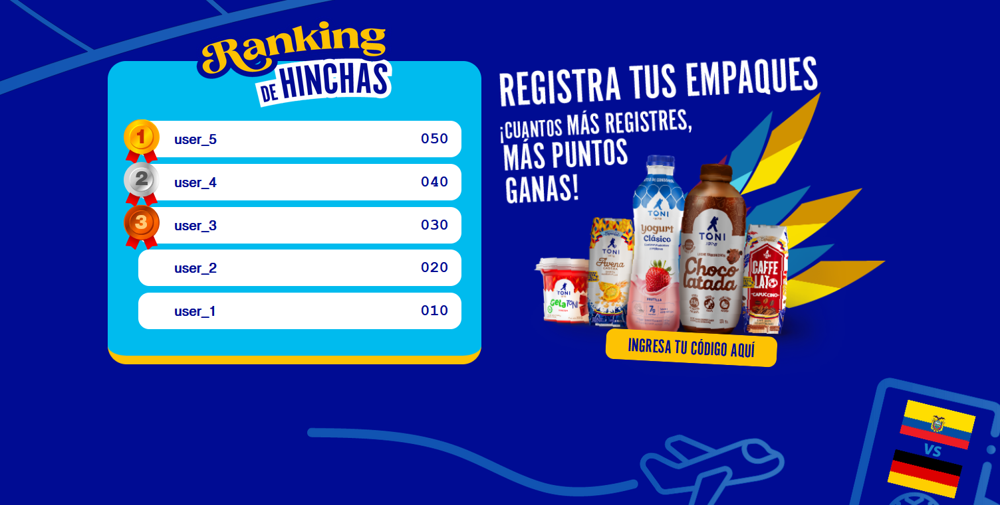
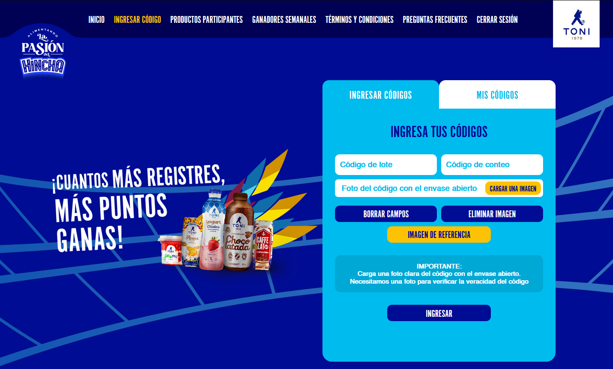
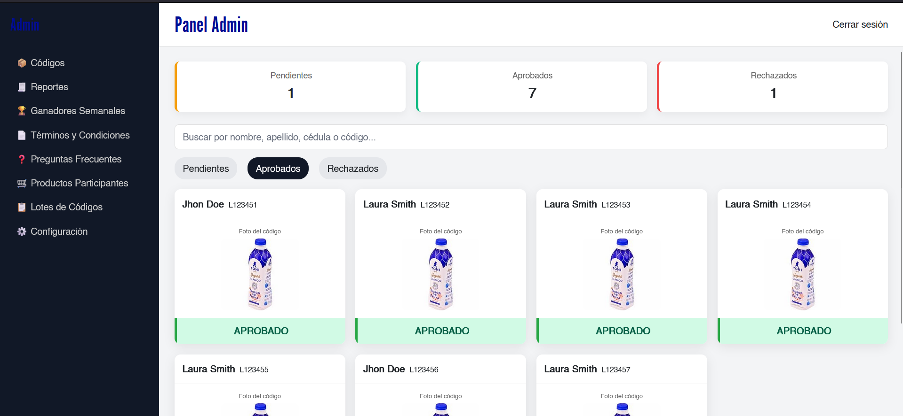
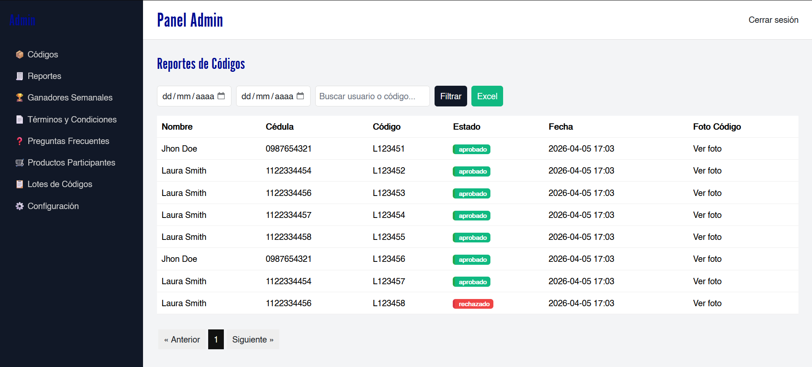

<div align="center">

# 🎯 Plataforma de Promociones — Promo Toni

### Sistema web completo para gestionar promociones de consumo masivo con registro de códigos, puntos acumulados y ganadores semanales.

<br/>


</div>

---

## 📋 Descripción

**Promo Toni** es una plataforma web diseñada para ejecutar promociones de consumo en marcas de alimentos y bebidas. Los consumidores compran productos participantes, encuentran el **código de lote** en el empaque, lo fotografían y lo envían desde la app para acumular puntos y participar por premios semanales.

El sistema incluye un **panel de administración completo** para revisar códigos, gestionar ganadores, editar contenido y exportar reportes, sin necesidad de tocar código.

---

## 📸 Vista del sistema

### 🏠 Página principal

<div align="center">
  
</div>

### 📊 Ranking en tiempo real

<div align="center">
  
</div>

### 📸 Envío de códigos

<div align="center">
  
</div>

### 🛠️ Panel de administración

<div align="center">
  
</div>

### 📊 Reportes y exportación

<div align="center">
  
</div>

---

## ✨ Características principales

### Para los consumidores

* 📝 **Registro y verificación de email** — flujo seguro con verificación obligatoria vía correo electrónico
* 📸 **Envío de códigos con foto** — el usuario sube una foto del código de lote del producto
* 🏆 **Ranking en tiempo real** — tabla pública con el top 5 de participantes por puntos
* 📅 **Ganadores semanales** — sección pública con los ganadores de cada semana (cédula enmascarada por privacidad)
* ❓ **Preguntas frecuentes y Términos & Condiciones** gestionados desde el admin

### Para el administrador

* ✅ **Revisión de códigos** — aprobar o rechazar registros de códigos con un motivo específico
* 📊 **Reportes filtrables** por rango de fechas y búsqueda, con **exportación a CSV**
* 📦 **Importación masiva de lotes** desde CSV (soporta delimitadores `,` y `;`, detección automática de cabecera)
* 🏅 **Ganadores semanales vía CSV** — carga semanal con desactivación automática de semanas anteriores
* ⚙️ **Configuración dinámica**:

  * Habilitar/deshabilitar el registro de nuevos usuarios
  * Cambiar modo de puntuación (por valor de lote o por conteo de códigos aprobados)
* ✏️ **Editor de Términos & Condiciones y FAQ** con editor de texto enriquecido (TipTap)
* 🛍️ **Gestión de productos participantes** (CRUD completo)

---

## 🏗️ Arquitectura y tecnologías

| Capa                 | Tecnología                                    |
| -------------------- | --------------------------------------------- |
| Backend              | **Laravel 12** + PHP 8.2+                     |
| Frontend             | **Vue 3** + **Inertia.js** (SPA sin API REST) |
| Estilos              | **Tailwind CSS** v3 + @tailwindcss/forms      |
| Editor rich-text     | **TipTap** v3                                 |
| Autenticación        | **Laravel Breeze** + Sanctum                  |
| Rutas en JS          | **Ziggy**                                     |
| Internacionalización | **laravel-lang** (español completo)           |
| Build                | **Vite** 7                                    |
| Base de datos        | MySQL / PostgreSQL compatible                 |

---

## 🗂️ Estructura de la base de datos

```
users               — Participantes y administradores (rol: cliente / admin)
codigos             — Envíos de códigos con foto y estado (pendiente / aprobado / rechazado)
lotes               — Lotes precargados por CSV con su valor en puntos
ganadores_semanales — Ganadores publicados por semana y año
productos_participantes — Productos habilitados para la promo
faqs                — Preguntas frecuentes
terminos_condiciones — Contenido legal editable
settings            — Configuración clave-valor
```

---

## 🔒 Seguridad y rendimiento

* Control de acceso por roles (`cliente` / `admin`) con Laravel **Gates**
* Verificación de email obligatoria antes de participar
* Restricción de duplicados en códigos (constraint único en DB + validación en app)
* Fotos almacenadas en disco privado (`storage/app/public`), acceso a través de symlink seguro
* Índices compuestos en tablas críticas para optimizar ranking y recálculo de puntos
* Caché de configuración para evitar consultas repetidas a la base de datos

---

## 🚀 Instalación local

```bash
# 1. Clonar el repositorio
git clone <repo-url> promo-toni
cd promo-toni

# 2. Instalar dependencias PHP y JS
composer install
npm install

# 3. Configurar entorno
cp .env.example .env
php artisan key:generate

# 4. Configurar base de datos en .env y ejecutar migraciones
php artisan migrate --seed

# 5. Enlazar el storage público
php artisan storage:link

# 6. Compilar assets
npm run build
# o en desarrollo:
npm run dev
```

---

## ⚙️ Variables de entorno clave

```env
APP_NAME="Promo Toni"
APP_URL=https://tudominio.com

DB_CONNECTION=mysql
DB_DATABASE=promo_toni

MAIL_MAILER=smtp
MAIL_FROM_ADDRESS=noreply@tudominio.com
MAIL_FROM_NAME="El Equipo de Toni"

FILESYSTEM_DISK=public
```

---

## 📁 Estructura del proyecto

```
app/
├── Http/Controllers/
│   ├── Admin/
│   │   ├── AdminController.php
│   │   ├── FaqController.php
│   │   ├── GanadoresSemanalesController.php
│   │   ├── LoteController.php
│   │   ├── ProductoParticipanteController.php
│   │   ├── SettingsController.php
│   │   └── TerminosController.php
│   ├── Auth/
│   │   ├── AuthenticatedSessionController.php
│   │   ├── EmailVerificationNotificationController.php
│   │   ├── EmailVerificationPromptController.php
│   │   ├── NewPasswordController.php
│   │   ├── PasswordController.php
│   │   ├── PasswordResetLinkController.php
│   │   ├── RegisteredUserController.php
│   │   └── VerifyEmailController.php
│   ├── Cliente/
│   │   └── CodigoController.php
│   ├── HomeController.php
│   └── ProfileController.php
├── Models/
└── Helpers/
    └── settings.php
resources/
├── js/
└── views/
routes/
├── web.php
└── auth.php
```

---

## 🧩 Casos de uso ideales

* ✅ Promociones de consumo masivo (alimentos, bebidas, lácteos)
* ✅ Campañas con puntos y premios semanales o mensuales
* ✅ Validación manual de participaciones con evidencia fotográfica
* ✅ Reportes descargables para auditoría
* ✅ Plataformas multi-producto con catálogo editable

---

## 👤 Autor

**Tu Nombre**
- GitHub: [@MarlonBarzola](https://github.com/MarlonBarzola)
- LinkedIn: [Marlon Barzola](https://www.linkedin.com/in/marlon-barzola-756a8b154/)

---

## 📄 Licencia

Este proyecto es software propietario. Todos los derechos reservados.

---

<div align="center">

**Desarrollado con ❤️ usando Laravel + Vue 3 + Inertia.js**

</div>
